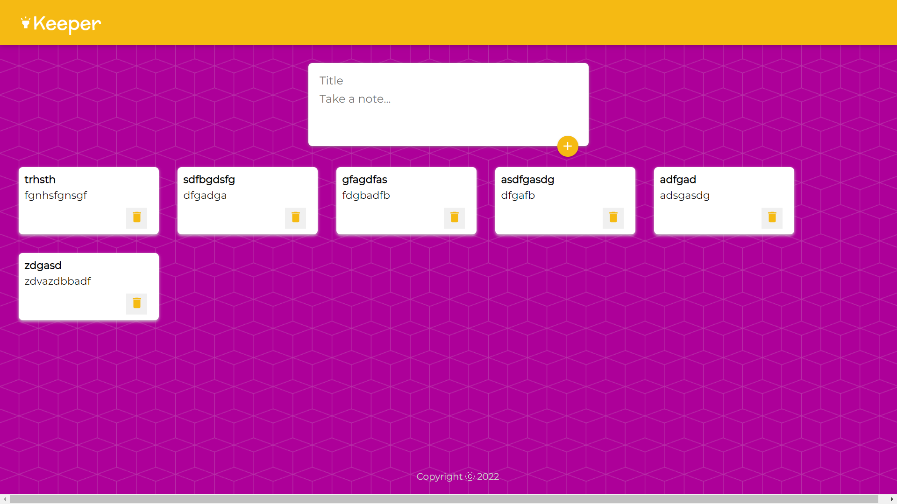

# Keeper-App

This is a Notes app made with react.  
User Can Create Notes and able to delete it.

## Setup
clone the repo in your directory
```
git clone https://github.com/Bharat1002/Keeper-App.git
```

run below command to move to keeper-app directory and download dependencies.
```
cd .\Keeper-App\
npm i
```

Start the react app with npm start to run the app in browser
```
npm start
```

###Snapshot of UI

